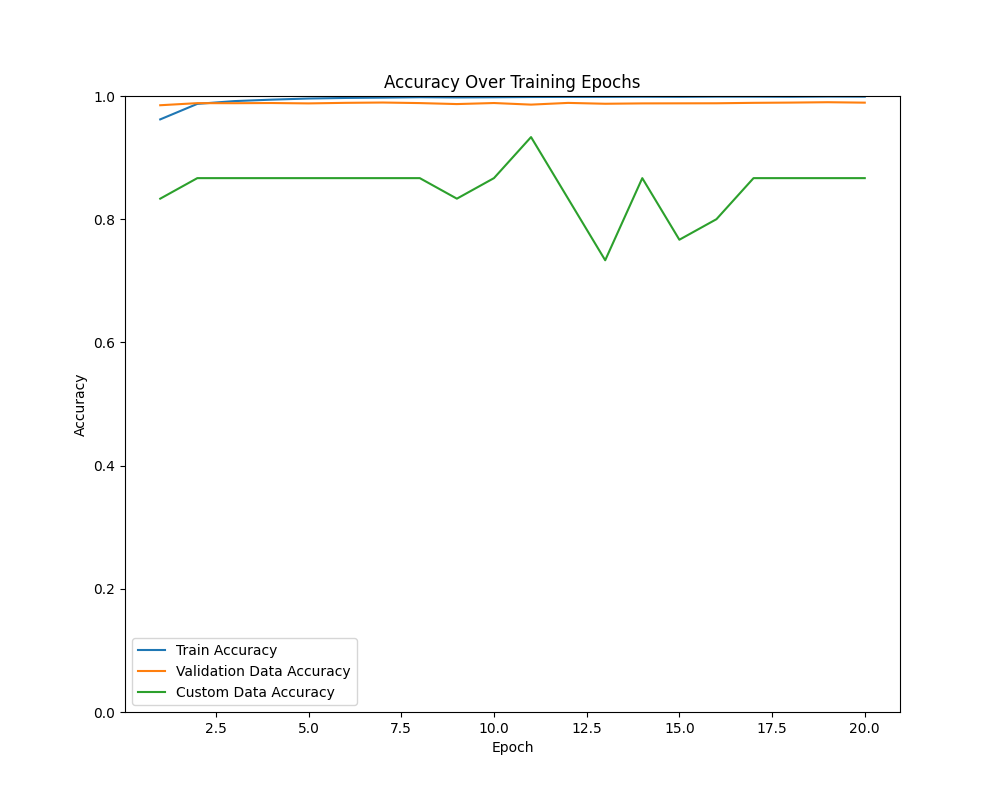
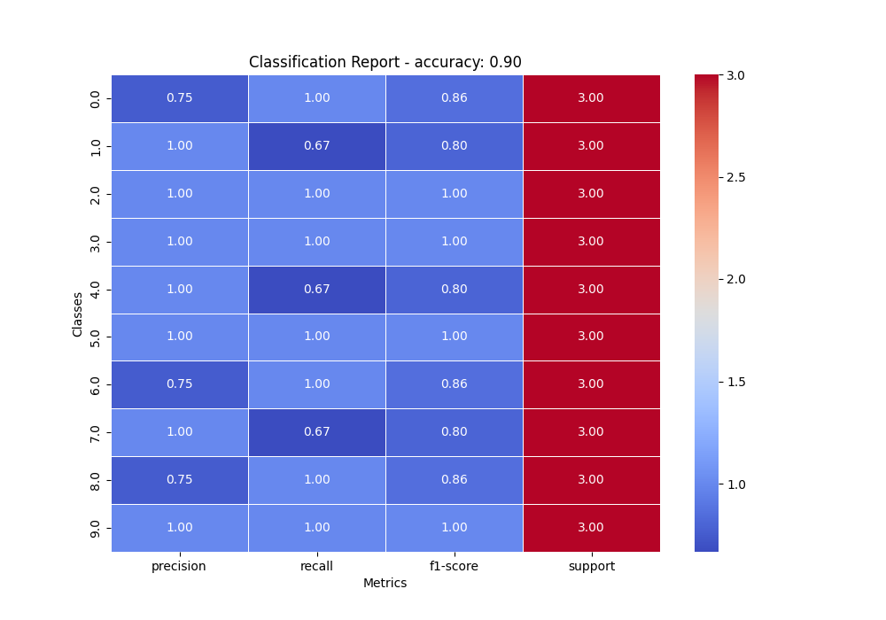

# Sprawozdanie z AI Lista 1

## Zad 1 & 2 - Siec Neuronowa

### Wykres accuracy od epok

### Metryki

Czas trenowania dobieralam na podstawie poprzedniego wykresu.
W tym wypadku - 4 epoki.

Metryki dla zbioru testowego Mnist:

Metryki dla zbioru cyfr napisanych przeze mnie:

## Zad 3 - Random Forest

### Metryki

Metryki dla zbioru testowego Mnist:

Metryki dla zbioru cyfr napisanych przeze mnie:

