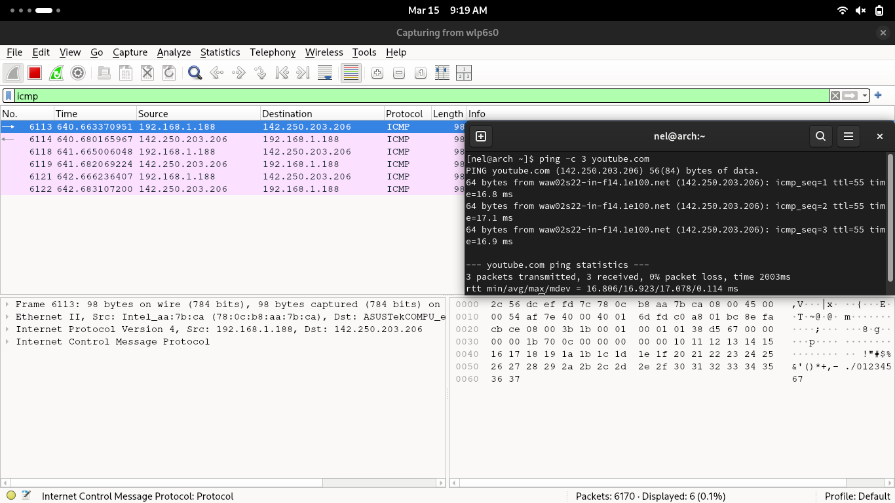
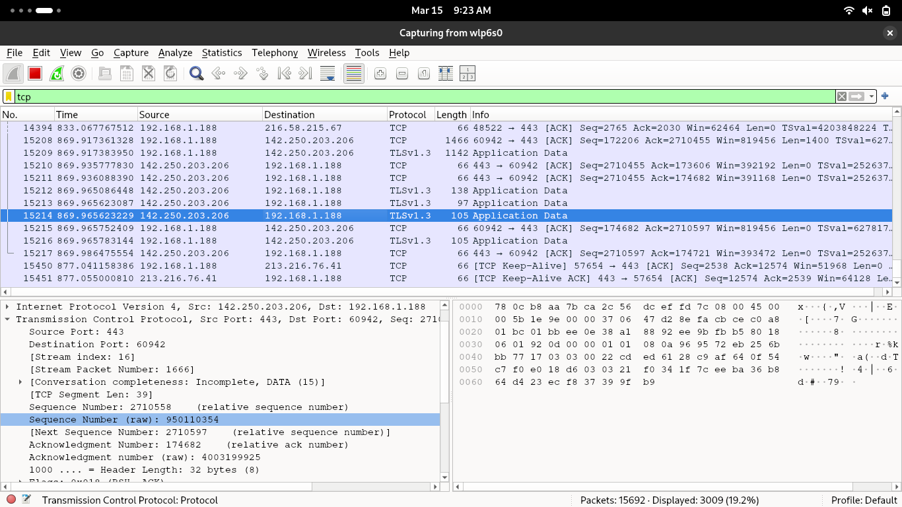
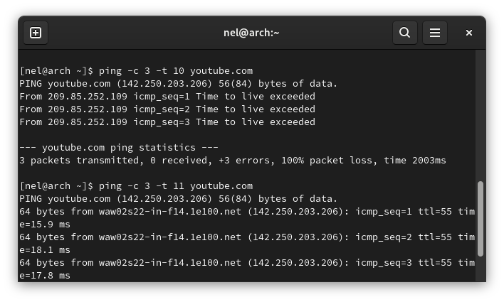
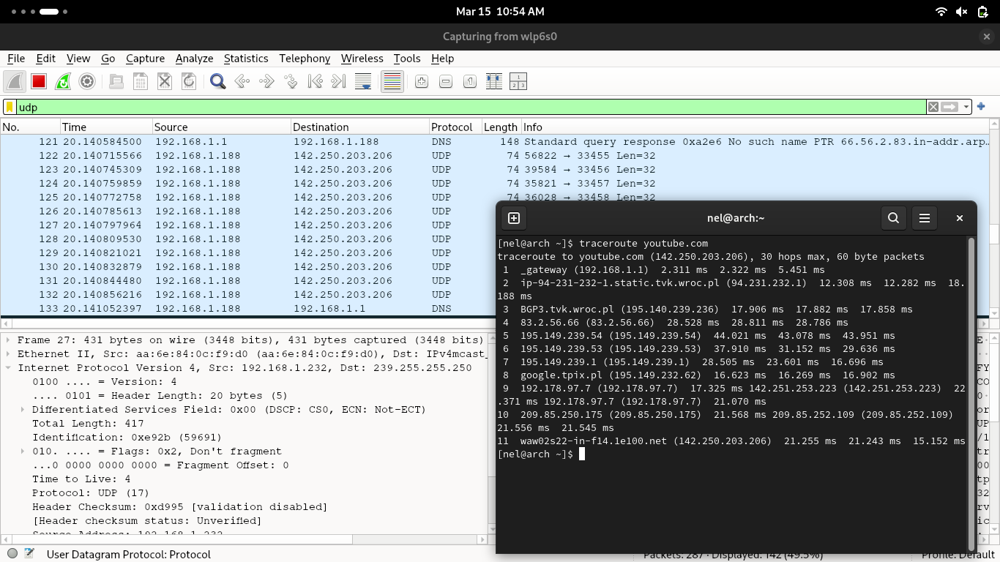
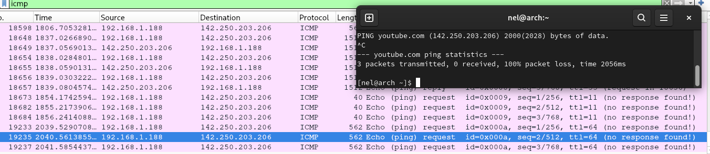
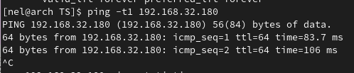
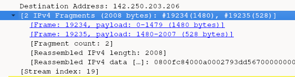
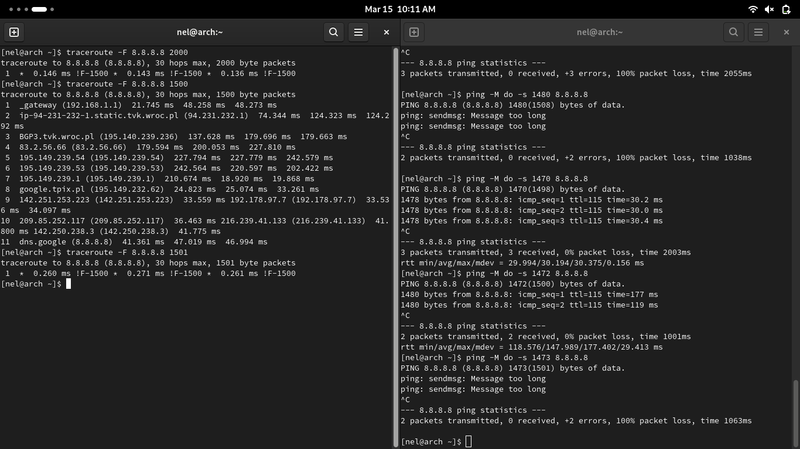
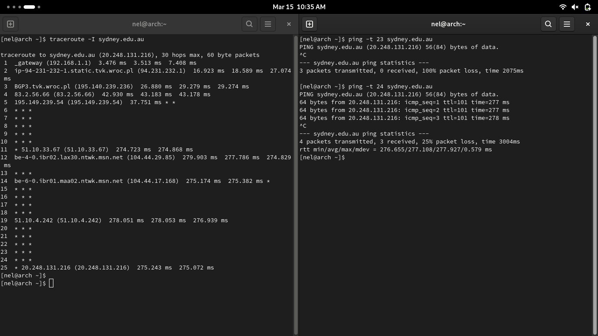
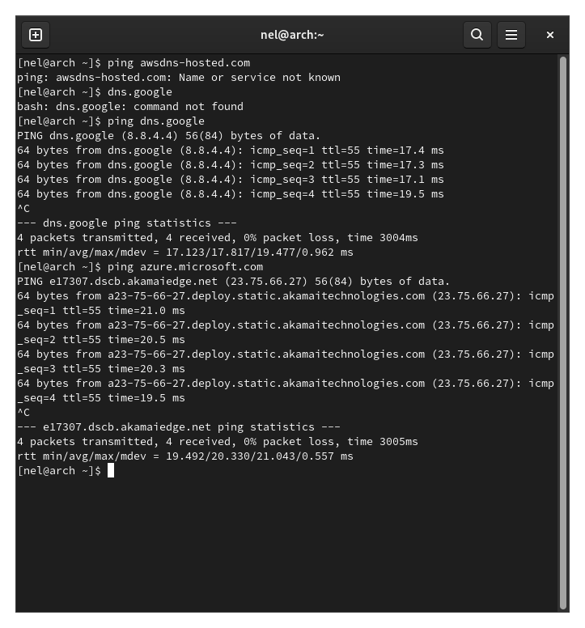

# Sprawozdanie - Technologie Sieciowe, Lista 1

## Komunikacja z zewnetrznym serwerem

Pingowalam serwer youtube'a, co, jak widac ponizej, dalo sie wychwycic WireSharkiem.
Dodatkowo, odpalilam jednoczesnie w przegladarce strone YouTube i, zgodnie z oczekiwniami,
dalo sie zaobserwowac komunikacje z tym samym adresem uzywajaca protokolu TCP.

Ponizej wyznaczalam liczbe wezlow do serwera youtube za pomoca pinga i traceroute'a.
Odleglosc z mojej sieci wynosi 11 wezlow:

## Rozne trasy

Jak widac ponizej - trasy przebyte przez pakiety moga byc rozne i miec rozne dlugosci,
w zaleznosci od - np. jak ponizej - ustawionego TTL.

## Fragmentacja pakietow i czas propagacji

Jak widac ponizej, YouTube i wiele innych serwerow blokuja pakiety, ktore wymagaja fragmentacji.

Spingowalam wiec kolege we wspolnej sieci lokalnej:

Jak widac, czas dojscia pakietow rozni sie znaczaco w wypadku wyslania standardowego 56B
pakietu a 64kB. Jest to niewatpliwie zwiazane z koniecznoscia czekania na wszystkie
fragmenty oraz zlozenia ich spowrotem.

Aby sprawdzic, czy pakiet rzeczywiscie wymaga fragmentacji, wystarczy uzyc odpowiednich flag 
w programach ping lub traceroute, co widac w nastepnej sekcji - lub uzyc programu WireShark:

## Najwiekszy niefragmentowany pakiet

Metoda bisekcji sprawdzilam, ze najwiekszy niefragmentowany pakiet to 1500B (z ramka).

## Komunikacja w LAN

Jak widac na jednym z poprzednich screenshotow - zgodnie z oczekiwaniami pakiet  
do urzadzenia w LAN nie wyjdzie poza LAN:

Dodatkowo, uzywajac narzedzia nc, mozna wysylac do siebie wiadomosci, a nastepnie podsluchiwac 
w WireSharku.

Natomiast WireShark nie podsluchuje takich rozmow pomiedzy innymi dwoma 
urzadzeniami w tej samej sieci lokalnej.

## Srednica internetu

Mozemy probowac eksperymentalnie wyznaczac najdluzsza sciezke do serwera, natomiast musimy 
brac pod uwage, ze tez znajdujemy sie w jednym z wezlow sieci, i to jednym z lepiej skomunikowanych, 
wiec najwieksza odleglosc do nas (i od nas) na pewno i tak bedzie mniejsza niz faktyczna 
srednica internetu.

Najdluzsza sciezka, jaka udalo mi sie znalezc to 24 do sydney.edu.au:

## Serwery chmurowe

 

Jak widac, w przypadku serwerow Google i Microsoft, dlugosc trasy nie odbiega za bardzo 
od standardowych 10 wezlow. Nie dziwi nas to, poniewaz serwery takich uslug musza byc 
bardzo dobrze skomunikowane.
