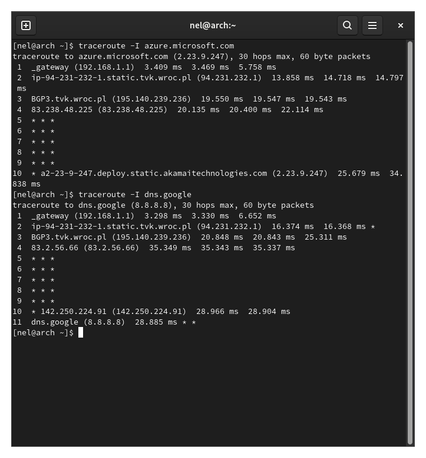

# Sprawozdanie - Technologie Sieciowe, Lista 1

## Komunikacja z zewnętrznym serwerem

Pingowałam serwer youtube'a, co, jak widać poniżej, dało się wychwycić WireSharkiem.
Dodatkowo, odpaliłam jednocześnie w przeglądarce stronę YouTube i, zgodnie z oczekiwaniami,
dało sie zaobserwować komunikację z tym samym adresem używającą protokołu TCP.

Poniżej wyznaczałam liczbę węzłów do serwera youtube za pomocą pinga i traceroute'a.
Odległość z mojej sieci wynosi 11 węzłów:

## Różne trasy

Jak widać poniżej - trasy przebyte przez pakiety mogą być różne i mieć różne długości,
w zależnosci od - np. jak poniżej - ustawionego TTL.

## Fragmentacja pakietów i czas propagacji

Jak widać poniżej, YouTube i wiele innych serweów blokują pakiety, które wymagają fragmentacji.

Spingowałam więc kolegę we wspólnej sieci lokalnej:

Jak widać, czas dojścia pakietów różni się znacząco w wypadku wysłania standardowego 56B
pakietu a 64kB. Jest to niewątpliwie związane z koniecznością czekania na wszystkie
fragmenty oraz złożenia ich spowrotem.

Aby sprawdzić, czy pakiet rzeczywiście wymaga fragmentacji, wystarczy użyć odpowiednich flag 
w programach ping lub traceroute, co widać w nastepnej sekcji - lub użyć programu WireShark:

## Największy niefragmentowany pakiet

Metodą bisekcji sprawdziłam, ąe największy niefragmentowany pakiet to 1500B (z ramką).

## Komunikacja w LAN

Jak widac na jednym z poprzednich screenshotów - zgodnie z oczekiwaniami pakiet  
do urządzenia w LAN nie wyjdzie poza LAN:

Dodatkowo, używając narzędzia nc, można wysyłać do siebie wiadomości, a następnie podsłuchiwać 
w WireSharku.

Natomiast WireShark nie podsłuchuje takich rozmów pomiędzy innymi dwoma 
urządzeniami w tej samej sieci lokalnej.

## Srednica internetu

Mozemy próbować eksperymentalnie wyznaczać najdłuzszą ścieżkę do serwera, natomiast musimy 
brać pod uwagę, że też znajdujemy się w jednym z węzłów sieci, i to jednym z lepiej skomunikowanych, 
więc największa odległość do nas (i od nas) na pewno i tak będzie mniejsza niż faktyczna 
średnica internetu.

Najdłuższa ścieżka, jaką udało mi się znaleźć to 24 do sydney.edu.au:

## Serwery chmurowe

 

Jak widać, w przypadku serwerów Google i Microsoft, długość trasy nie odbiega za bardzo 
od 10 węzłów. Nie dziwi nas to, ponieważ serwery takich usług muszą być 
bardzo dobrze skomunikowane.
